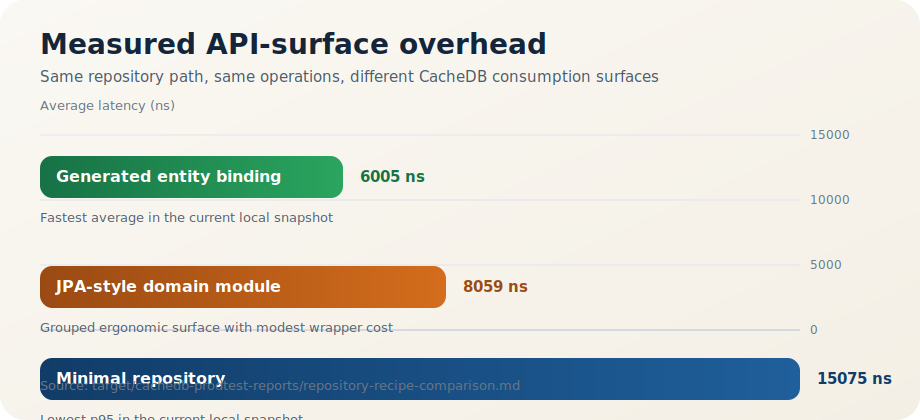
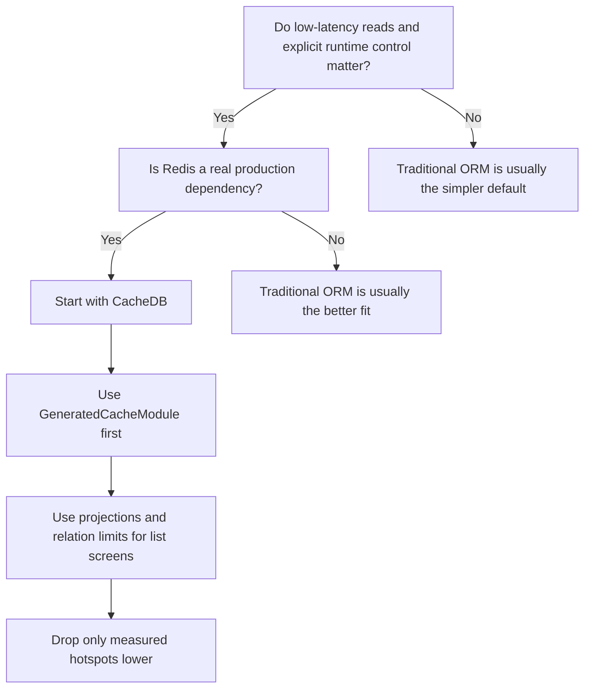
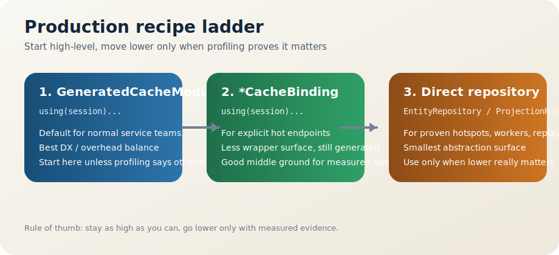

# cache-database

Turkce surum: [tr/README.md](tr/README.md)

Production recipe guide: [docs/production-recipes.md](docs/production-recipes.md)  
ORM alternative guide: [docs/orm-alternative.md](docs/orm-alternative.md)  
Public beta readiness: [docs/public-beta-readiness.md](docs/public-beta-readiness.md)  
Release checklist: [docs/release-checklist.md](docs/release-checklist.md)

`cache-database` is a Redis-first persistence library for teams that care about production runtime overhead and still want an ORM-like developer experience.

It gives you:

- Redis-first reads and writes
- PostgreSQL durability through async write-behind
- compile-time generated metadata instead of runtime reflection
- explicit relation loading, projections, and hotspot escape hatches
- generated ergonomics that stay close to minimal repository overhead

## Install In 5 Minutes

If you want the fastest path:

1. add CacheDB dependencies to your `pom.xml`
2. point it at Redis and PostgreSQL
3. start with `GeneratedCacheModule.using(session)...`

### Maven: Spring Boot

```xml
<properties>
    <cachedb.version>0.1.0-beta.1</cachedb.version>
</properties>

<dependencies>
    <dependency>
        <groupId>com.reactor.cachedb</groupId>
        <artifactId>cachedb-spring-boot-starter</artifactId>
        <version>${cachedb.version}</version>
    </dependency>
    <dependency>
        <groupId>com.reactor.cachedb</groupId>
        <artifactId>cachedb-annotations</artifactId>
        <version>${cachedb.version}</version>
    </dependency>
    <dependency>
        <groupId>org.springframework.boot</groupId>
        <artifactId>spring-boot-starter-jdbc</artifactId>
    </dependency>
    <dependency>
        <groupId>org.postgresql</groupId>
        <artifactId>postgresql</artifactId>
        <scope>runtime</scope>
    </dependency>
</dependencies>

<build>
    <plugins>
        <plugin>
            <artifactId>maven-compiler-plugin</artifactId>
            <configuration>
                <annotationProcessorPaths>
                    <path>
                        <groupId>com.reactor.cachedb</groupId>
                        <artifactId>cachedb-processor</artifactId>
                        <version>${cachedb.version}</version>
                    </path>
                </annotationProcessorPaths>
            </configuration>
        </plugin>
    </plugins>
</build>
```

Use `spring-boot-starter-jdbc` only if your app does not already bring a `DataSource`
through something like `spring-boot-starter-data-jpa`. CacheDB's Spring Boot
starter expects an existing Spring `DataSource`; it does not create JDBC
auto-configuration by itself.

### Maven: Plain Java

```xml
<properties>
    <cachedb.version>0.1.0-beta.1</cachedb.version>
</properties>

<dependencies>
    <dependency>
        <groupId>com.reactor.cachedb</groupId>
        <artifactId>cachedb-starter</artifactId>
        <version>${cachedb.version}</version>
    </dependency>
    <dependency>
        <groupId>com.reactor.cachedb</groupId>
        <artifactId>cachedb-annotations</artifactId>
        <version>${cachedb.version}</version>
    </dependency>
    <dependency>
        <groupId>redis.clients</groupId>
        <artifactId>jedis</artifactId>
        <version>5.2.0</version>
    </dependency>
    <dependency>
        <groupId>org.postgresql</groupId>
        <artifactId>postgresql</artifactId>
        <version>42.7.4</version>
    </dependency>
</dependencies>

<build>
    <plugins>
        <plugin>
            <artifactId>maven-compiler-plugin</artifactId>
            <configuration>
                <annotationProcessorPaths>
                    <path>
                        <groupId>com.reactor.cachedb</groupId>
                        <artifactId>cachedb-processor</artifactId>
                        <version>${cachedb.version}</version>
                    </path>
                </annotationProcessorPaths>
            </configuration>
        </plugin>
    </plugins>
</build>
```

### Minimal Spring Boot config

```yaml
spring:
  datasource:
    url: jdbc:postgresql://127.0.0.1:5432/app
    username: app
    password: app

cachedb:
  enabled: true
  profile: production
  redis:
    uri: redis://127.0.0.1:6379
```

For the full copy-paste path, see [Getting Started](docs/getting-started.md).

## Why CacheDB

Choose CacheDB when:

- low-latency reads matter
- Redis is a real production dependency in your architecture
- you want explicit control over read-model shape
- you want a library that starts ergonomic but lets you go lower on proven hotspots

## Why Not CacheDB

Stay with a traditional JPA/Hibernate-style stack when:

- your application is mainly driven by SQL joins and relational reporting
- you want ORM behavior to stay mostly implicit
- your team does not want to think about projections, fetch limits, or relation shape
- Redis is not part of the real runtime plan

That tradeoff is intentional. CacheDB is optimized for explicit control and low runtime overhead, not for hiding persistence behavior.

## How To Start

1. Start with Spring Boot starter or the plain Java bootstrap path.
2. Use `GeneratedCacheModule.using(session)...` as the default application surface.
3. Move only measured hotspots lower to `*CacheBinding.using(session)...` or direct repositories.

For relation-heavy screens, start with projections and `withRelationLimit(...)` before reaching for lower-level repository code.

## Quick Comparison

| Topic | CacheDB | Traditional ORM |
| --- | --- | --- |
| Primary read path | Redis-first | Database-first |
| Metadata | Compile-time generated | Usually runtime reflection + ORM metadata |
| Default relation model | Explicit fetch plans and loaders | Mostly implicit lazy/eager graph behavior |
| Hotspot strategy | Measured escape hatch to lower surfaces | Often stays inside ORM abstractions |
| Best fit | Low-latency services, Redis-centric systems | Relational domains, SQL-centric applications |

## Measured Evidence

The claim here is not that ergonomics are free.

The claim is narrower and more useful:

- generated ergonomics stay in the same low-overhead band as the minimal repository path
- the real production cost still comes from query shape, relation hydration, Redis contention, and write-behind pressure

Latest local recipe benchmark snapshot:

| Surface | Avg ns | p95 ns | Read it as |
| --- | ---: | ---: | --- |
| Generated entity binding | 6005 | 13400 | Fastest average in this local run |
| JPA-style domain module | 8059 | 20300 | Grouped ergonomic surface with modest wrapper cost |
| Minimal repository | 15075 | 9600 | Lowest p95 in this local run |



Measured operations in this snapshot:

- `activeCustomers`
- `customersPage`
- `topCustomerOrdersSummary`
- `promoteVipCustomer`
- `deleteCustomer`

Re-run the report with:

```powershell
mvn -q -f cachedb-production-tests/pom.xml exec:java `
  "-Dexec.mainClass=com.reactor.cachedb.prodtest.scenario.RepositoryRecipeBenchmarkMain"
```

Output:

- `target/cachedb-prodtest-reports/repository-recipe-comparison.md`
- `target/cachedb-prodtest-reports/repository-recipe-comparison.json`

Interpretation note:

- this benchmark is directional, not a promise that one wrapper surface always wins every micro-run
- the important result is that generated ergonomics remain in the same order of magnitude as direct repository usage

## Should You Start With CacheDB?



## Core Design

- no runtime reflection
- compile-time generated entity metadata
- Redis-first reads and writes
- PostgreSQL durability via async write-behind
- explicit relation loading and projection-based read models
- guardrails for hot-data budgets and runtime pressure

## Production Recipe Ladder



Rule of thumb:

1. start with `GeneratedCacheModule.using(session)...`
2. move only hot endpoints to `*CacheBinding.using(session)...`
3. drop only proven hotspots, replay paths, or workers to direct repositories

## Fastest Start

### Spring Boot

```yaml
spring:
  datasource:
    url: jdbc:postgresql://127.0.0.1:5432/app
    username: app
    password: app

cachedb:
  enabled: true
  profile: production
  redis:
    uri: redis://127.0.0.1:6379
```

### Plain Java

```java
JedisPooled jedis = new JedisPooled("redis://127.0.0.1:6379");
DataSource dataSource = ...;

try (CacheDatabase cacheDatabase = CacheDatabase.bootstrap(jedis, dataSource)
        .production()
        .keyPrefix("app-cache")
        .register(com.reactor.cachedb.examples.entity.GeneratedCacheBindings::register)
        .start()) {
    // use repositories here
}
```

What you get on the recommended path:

- production-oriented defaults
- split foreground/background Redis pools
- generated registrar auto-registration
- same-port admin UI in Spring Boot
- clear projection + relation-limit path for relation-heavy reads

## Read Next

- [Production Recipes](docs/production-recipes.md)
- [Getting Started](docs/getting-started.md)
- [ORM Alternative Guide](docs/orm-alternative.md)
- [Public Beta Launch Kit](docs/public-beta-launch-kit.md)
- [Maven Central Publish Checklist](docs/maven-central-publish-checklist.md)
- [Public Beta Readiness](docs/public-beta-readiness.md)
- [Release Checklist](docs/release-checklist.md)
- [Positioning Announcement Draft](docs/positioning-announcement.md)
- [Spring Boot Starter](docs/spring-boot-starter.md)
- [Tuning Parameters](docs/tuning-parameters.md)
- [Production Tests](cachedb-production-tests/README.md)
- [Examples](cachedb-examples/README.md)
- [Architecture](docs/architecture.md)

## Community

- [License](LICENSE)
- [Contributing](CONTRIBUTING.md)
- [Security Policy](SECURITY.md)
- [Code of Conduct](CODE_OF_CONDUCT.md)
- [Support](SUPPORT.md)
- [Changelog](CHANGELOG.md)
