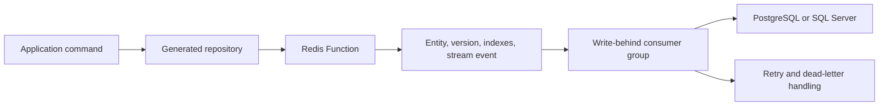

# CacheDB Architecture

Turkish version: [../tr/docs/architecture.md](../tr/docs/architecture.md)

## 1. System Boundary

CacheDB is a Redis-first persistence and read-model framework. It is not a
transparent cache in front of every SQL query.

- Redis serves explicitly declared low-latency entity and projection routes.
- PostgreSQL or SQL Server remains the durable source of truth.
- Writes are accepted in Redis and persisted by versioned write-behind.
- Archive and history reads use explicit, bounded source routes.
- Compile-time processors generate codecs, metadata, repository implementations,
  Spring beans, relation loaders, and projection mappings without reflection.

The application must decide which routes belong in Redis. CacheDB makes that
decision executable, bounded, observable, and testable.

## 2. Application Programming Model

Entity classes describe storage shape:

- `@CacheEntity`, `@CacheId`, and `@CacheColumn` map durable rows.
- `@CacheRelation` describes CacheDB loading metadata. It does not create a
  database foreign key.
- `@CacheProjectionRecord` defines compact or ranked read models.

Repository interfaces describe application behavior:

- `@CacheLookup` is a Redis-only point lookup with explicit miss status.
- `@HotRoute` is a bounded Redis entity or projection window.
- `@SourceRoute` and `@SourceSql` are bounded durable reads.
- `@WarmRoute` derives a preload plan from an existing hot route.
- `@CacheCommand` declares acknowledgement and durability requirements.

`HotLookup.NOT_CACHED` never means the durable row is absent. Hidden SQL
fallback is intentionally not part of a hot route.

## 3. Write Flow

1. The repository validates the command shape and generated ID policy.
2. Redis atomically updates payload, version, indexes, and the durable stream.
3. The caller receives a `WriteReceipt` according to the declared
   acknowledgement mode.
4. Workers batch stream events and apply version-guarded SQL upsert or delete.
5. Retries are idempotent; stale versions cannot overwrite newer durable state.

`REDIS_ACCEPTED` keeps SQL latency off the request path. `SQL_DURABLE` waits for
the receipt to become durable and must have a bounded timeout.

## 4. Read Flows

### Redis-only detail

`@CacheLookup` returns `HIT`, `NOT_CACHED`, `TOMBSTONED`, or
`OUTSIDE_HOT_POLICY`. The application maps these states explicitly. A miss does
not start SQL work.

### Redis hot window

`@HotRoute` uses a bounded `WindowRequest`, keyset cursor, route-level memory
contract, and coverage scope. Projection routes apply the window before wide
entity hydration whenever possible.

### Durable source window

`@SourceRoute` and reviewed `@SourceSql` methods query the selected SQL provider
with a compile-time row cap and query timeout. Results do not populate Redis
implicitly.

### Warm and coverage

`@WarmRoute` reuses the exact hot-route predicate, sort, projection, and scope.
Warm can hydrate projections only or entities plus projections. A completed run
records route coverage so tests and operations can distinguish an empty result
from an incomplete Redis scope.

## 5. Relations And N+1 Control

Relations are explicit and bounded:

- database primary/foreign keys protect durable integrity
- `@CacheRelation` tells CacheDB how to batch-load related rows
- `@CacheLookup(maxRelationRows=...)` limits detail previews
- large child collections use projection windows instead of aggregate hydration
- generated loaders partition parent IDs and avoid one SQL call per parent

A database foreign key without `@CacheRelation` does not enable CacheDB
preloading. `@CacheRelation` without a database foreign key can load rows, but
durable referential integrity becomes the application's responsibility.

## 6. Hot-Set And Memory Model

Redis capacity is controlled by several independent contracts:

- entity admission policy: count, time, state, custom, or composite
- route page and hot-window limits
- projection payload size and ranked indexes
- per-tenant quota and route memory budget
- Redis `maxmemory` with CacheDB-owned `noeviction` discipline
- incremental reconciliation for rows that leave the policy

The framework rejects unsafe query shapes before execution where possible.
Production strict mode must not silently replace a required projection with a
wide entity scan.

## 7. Consistency Model

The write path is eventually consistent between Redis and the durable provider.
Correctness depends on:

- Redis AOF and stream durability
- monotonic entity versions
- version-gated SQL writes
- idempotent retries and dead-letter recovery
- outbox/CDC apply when another application changes SQL directly
- scheduled warm and reconciliation as a bounded repair loop

Projection refresh may be asynchronous. Route-specific projection lag and
coverage must be observable before traffic is cut over.

## 8. Multi-Pod Coordination

All application pods share Redis consumer groups. Consumer names include a
pod-unique instance ID so pending work can be claimed after a crash.

- write-behind and projection workers scale through shared consumer groups
- scheduled warm uses a Redis lease so one pod executes a job at a time
- cleanup, reporting, and history loops use leader leases where singleton work
  is required
- lease loss is detected and does not write a false completion marker
- worker and SQL pool sizing is calculated for the cluster total, not one pod

Redis is both the data plane for critical reads and the coordination plane for
workers. It must be operated with persistence, failover, timeouts, and resource
limits appropriate to that role.

## 9. SQL Provider Model

`cachedb-storage-jdbc` owns shared source-query and provider contracts.
`cachedb-storage-postgres` and `cachedb-storage-mssql` provide vendor dialects,
locking, idempotency, retry classification, and metadata behavior.

Spring Boot applications select exactly one provider starter. `AUTO` succeeds
only when one provider is present and fails startup on an ambiguous classpath.

Provider-specific tuning remains necessary:

- connection and statement timeout chain
- pool size versus total worker concurrency
- transaction isolation and lock timeout
- batch and parameter limits
- failover behavior of the JDBC driver and pool

## 10. Module Map

| Module | Responsibility |
| --- | --- |
| `cachedb-annotations` | Entity, projection, repository, route, warm, command, and ID contracts |
| `cachedb-processor` | Compile-time validation and reflection-free code generation |
| `cachedb-core` | Repository contracts, query model, coverage, policies, and guardrails |
| `cachedb-storage-redis` | Redis Functions, payload/index storage, streams, coverage, and ID generation |
| `cachedb-storage-jdbc` | Shared JDBC source and provider SPI |
| `cachedb-storage-postgres` | PostgreSQL durable provider |
| `cachedb-storage-mssql` | SQL Server durable provider |
| `cachedb-starter` | Runtime bootstrap, warm runner, workers, and operational wiring |
| `cachedb-spring-boot-starter-*` | Core, provider, and optional admin auto-configuration |
| `cachedb-spring-boot-test` | Route coverage and integration-test helpers |
| `cachedb-maven-plugin` | Build-time provider and configuration doctor |
| `cachedb-migration-recipes` | Migration planning, warm, compare, and cutover evidence |
| `cachedb-bom` | Consistent dependency versions |

## 11. Operations And Observability

The internal admin and Actuator surfaces expose:

- provider identity and configuration health
- write-behind backlog, retry, and dead-letter state
- projection lag and route coverage
- Redis pressure, admission, eviction, and tenant quota signals
- scheduled warm, reconciliation, and lease state
- migration parity, latency, memory, and cutover evidence

Admin endpoints are operational surfaces. Keep them behind the application's
gateway/authentication boundary and outside the public request path.

## 12. Deliberate Limits

- Composite primary keys are not supported by the declarative repository API;
  use a stable surrogate ID and indexed business key fields.
- CacheDB does not infer hot routes from arbitrary application queries.
- CacheDB does not turn every SQL table into a Redis entity automatically.
- Large reporting, export, and archive scans remain database/reporting jobs.
- A library test cannot certify an application's SQL Server Always On or
  PostgreSQL HA topology; each deployment must run its own failover proof.

These limits keep behavior explicit and prevent expensive production work from
being hidden behind ORM-like convenience.
