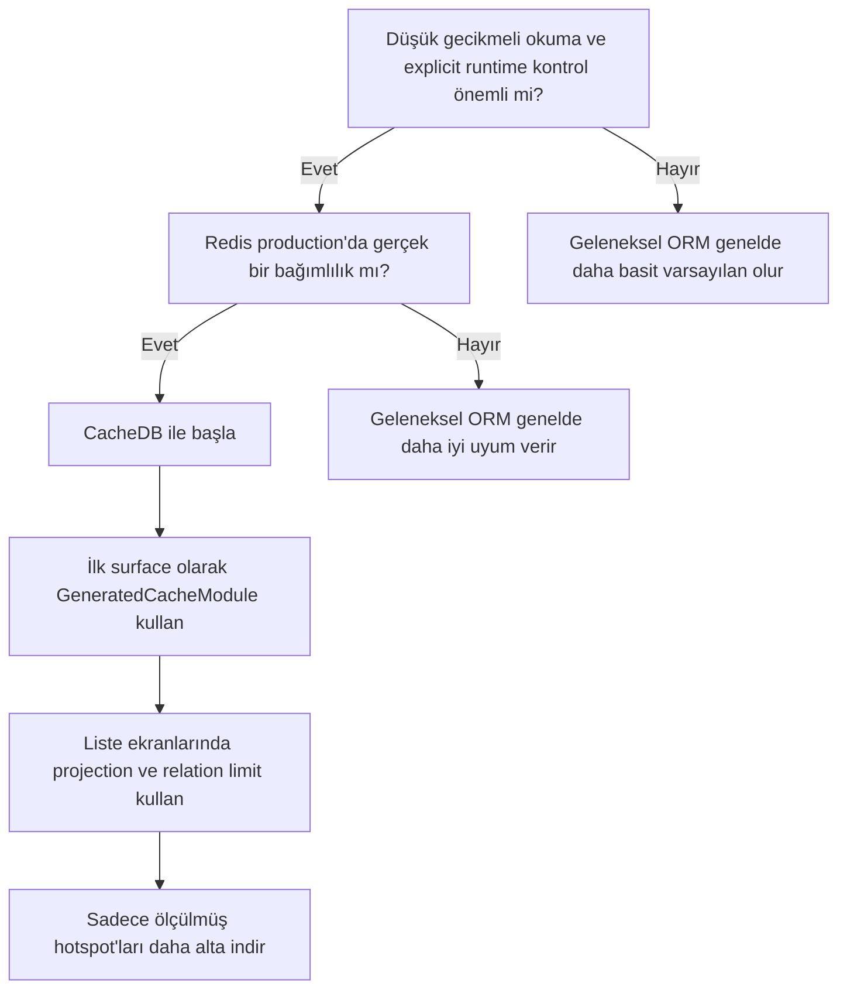

# cache-database

Bu dosya, projenin kullanıcı odaklı Türkçe giriş dokümanıdır.

Teknik mimari için: [docs/architecture.md](docs/architecture.md)  
Production recipe rehberi için: [docs/production-recipes.md](docs/production-recipes.md)  
ORM alternatifi rehberi için: [docs/orm-alternative.md](docs/orm-alternative.md)  
Public beta readiness için: [docs/public-beta-readiness.md](docs/public-beta-readiness.md)  
Release checklist için: [docs/release-checklist.md](docs/release-checklist.md)

`cache-database`, production runtime overhead'ini düşük tutmayı birinci sınıf tasarım ilkesi olarak gören Redis-first bir persistence kütüphanesidir. Bunu yaparken geliştirici deneyimini de ORM benzeri ve kolay tüketilebilir bir seviyede tutmayı hedefler.

Şunları sunar:

- Redis-first okuma ve yazma yolu
- async write-behind ile PostgreSQL kalıcılığı
- runtime reflection yerine compile-time generated metadata
- explicit relation loading, projection ve hotspot kaçış hatları
- minimal repository yoluna yakın kalan generated ergonomi

## 5 Dakikada Kurulum

En hızlı yol şu:

1. `pom.xml` içine CacheDB dependency'lerini ekle
2. Redis ve PostgreSQL bağlantısını tanımla
3. uygulama kodunda `GeneratedCacheModule.using(session)...` ile başla

### Maven: Spring Boot

```xml
<properties>
    <cachedb.version>0.1.0-beta.1</cachedb.version>
</properties>

<dependencies>
    <dependency>
        <groupId>com.reactor.cachedb</groupId>
        <artifactId>cachedb-spring-boot-starter</artifactId>
        <version>${cachedb.version}</version>
    </dependency>
    <dependency>
        <groupId>com.reactor.cachedb</groupId>
        <artifactId>cachedb-annotations</artifactId>
        <version>${cachedb.version}</version>
    </dependency>
    <dependency>
        <groupId>org.springframework.boot</groupId>
        <artifactId>spring-boot-starter-jdbc</artifactId>
    </dependency>
    <dependency>
        <groupId>org.postgresql</groupId>
        <artifactId>postgresql</artifactId>
        <scope>runtime</scope>
    </dependency>
</dependencies>

<build>
    <plugins>
        <plugin>
            <artifactId>maven-compiler-plugin</artifactId>
            <configuration>
                <annotationProcessorPaths>
                    <path>
                        <groupId>com.reactor.cachedb</groupId>
                        <artifactId>cachedb-processor</artifactId>
                        <version>${cachedb.version}</version>
                    </path>
                </annotationProcessorPaths>
            </configuration>
        </plugin>
    </plugins>
</build>
```

`spring-boot-starter-jdbc` bağımlılığını sadece uygulama zaten
`spring-boot-starter-data-jpa` gibi bir yolla `DataSource` getirmiyorsa ekle.
CacheDB Spring Boot starter kendi başına JDBC auto-config açmaz; mevcut bir
Spring `DataSource` bekler.

### Maven: Plain Java

```xml
<properties>
    <cachedb.version>0.1.0-beta.1</cachedb.version>
</properties>

<dependencies>
    <dependency>
        <groupId>com.reactor.cachedb</groupId>
        <artifactId>cachedb-starter</artifactId>
        <version>${cachedb.version}</version>
    </dependency>
    <dependency>
        <groupId>com.reactor.cachedb</groupId>
        <artifactId>cachedb-annotations</artifactId>
        <version>${cachedb.version}</version>
    </dependency>
    <dependency>
        <groupId>redis.clients</groupId>
        <artifactId>jedis</artifactId>
        <version>5.2.0</version>
    </dependency>
    <dependency>
        <groupId>org.postgresql</groupId>
        <artifactId>postgresql</artifactId>
        <version>42.7.4</version>
    </dependency>
</dependencies>

<build>
    <plugins>
        <plugin>
            <artifactId>maven-compiler-plugin</artifactId>
            <configuration>
                <annotationProcessorPaths>
                    <path>
                        <groupId>com.reactor.cachedb</groupId>
                        <artifactId>cachedb-processor</artifactId>
                        <version>${cachedb.version}</version>
                    </path>
                </annotationProcessorPaths>
            </configuration>
        </plugin>
    </plugins>
</build>
```

### Minimal Spring Boot config

```yaml
spring:
  datasource:
    url: jdbc:postgresql://127.0.0.1:5432/app
    username: app
    password: app

cachedb:
  enabled: true
  profile: production
  redis:
    uri: redis://127.0.0.1:6379
```

Tam kopyala-yapıştır akışı için [Getting Started](docs/getting-started.md) rehberine bak.

## Neden CacheDB

Şu durumlarda CacheDB seç:

- düşük gecikmeli okumalar önemliyse
- Redis production mimarisinin gerçek bir parçasıysa
- read-model şekli üzerinde explicit kontrol istiyorsan
- ergonomik bir başlangıç yüzeyi ama gerektiğinde daha alt seviyeye inen bir kaçış hattı istiyorsan

## Neden CacheDB Değil

Şu durumlarda geleneksel JPA/Hibernate benzeri bir stack daha uygun olur:

- uygulamanın ana yükünü SQL join ve ilişkisel raporlama taşıyorsa
- ORM davranışının büyük ölçüde implicit kalması bekleniyorsa
- ekip projection, fetch limit ve relation şekli düşünmek istemiyorsa
- Redis production mimarisinde gerçek bir bağımlılık değilse

Bu ayrım bilerek var. CacheDB, persistence davranışını gizlemek için değil; explicit kontrol ve düşük runtime overhead için optimize edildi.

## Nasıl Başlanmalı

1. Spring Boot starter veya plain Java bootstrap yolu ile başla.
2. Varsayılan uygulama surface'i olarak `GeneratedCacheModule.using(session)...` kullan.
3. Sadece ölçülmüş hotspot'ları `*CacheBinding.using(session)...` veya doğrudan repository tarafına indir.

Relation-ağır ekranlarda önce projection ve `withRelationLimit(...)` kullan; daha alt repository seviyesine bundan sonra in.

## Hızlı Karşılaştırma

| Konu | CacheDB | Geleneksel ORM |
| --- | --- | --- |
| Birincil okuma yolu | Redis-first | Database-first |
| Metadata | Compile-time generated | Genelde runtime reflection + ORM metadata |
| Varsayılan relation modeli | Explicit fetch plan ve loader | Çoğu zaman implicit lazy/eager graph davranışı |
| Hotspot stratejisi | Ölçülmüş kaçış hattı ile daha alt surface'e inilir | Çoğu zaman ORM soyutlamaları içinde kalınır |
| En iyi uyum | Düşük gecikmeli servisler, Redis-merkezli sistemler | İlişkisel alanlar, SQL-merkezli uygulamalar |

## Ölçülmüş Kanıt

Buradaki iddia ergonominin bedava olduğu değil.

Buradaki daha dürüst ve daha faydalı iddia şu:

- generated ergonomi, minimal repository yolu ile aynı düşük-overhead bandında kalabiliyor
- production maliyetinin asıl kaynağı hâlâ query şekli, relation hydration, Redis contention ve write-behind baskısı

Son yerel recipe benchmark özeti:

| Surface | Avg ns | p95 ns | Nasıl okunmalı |
| --- | ---: | ---: | --- |
| Generated entity binding | 6005 | 13400 | Bu yerel koşuda ortalamada en hızlı yüzey |
| JPA-style domain modüle | 8059 | 20300 | Gruplanmış ergonomik surface, makul wrapper maliyeti |
| Minimal repository | 15075 | 9600 | Bu yerel koşuda en düşük p95 |


Bu ölçümde karşılaştırılan operasyonlar:

- `activeCustomers`
- `customersPage`
- `topCustomerOrdersSummary`
- `promoteVipCustomer`
- `deleteCustomer`

Raporu yeniden üretmek için:

```powershell
mvn -q -f cachedb-production-tests/pom.xml exec:java `
  "-Dexec.mainClass=com.reactor.cachedb.prodtest.scenario.RepositoryRecipeBenchmarkMain"
```

Çıktı:

- `target/cachedb-prodtest-reports/repository-recipe-comparison.md`
- `target/cachedb-prodtest-reports/repository-recipe-comparison.json`

Yorum notu:

- bu benchmark yön gösterir; her mikro koşuda aynı wrapper surface'in kazanacağını vaat etmez
- asıl sonuç, generated ergonominin doğrudan repository kullanımıyla aynı büyüklük mertebesinde kalmasıdır

## CacheDB ile Başlamalı Mısın?



## Temel Tasarım

- runtime reflection yok
- compile-time generated entity metadata var
- Redis-first okuma ve yazma yolu var
- PostgreSQL kalıcılığı async write-behind ile sağlanıyor
- relation loading ve projection tabanlı read-model explicit
- hot-data bütçesi ve runtime basıncı için guardrail'lar var

## Production Recipe Merdiveni


Pratik kural:

1. `GeneratedCacheModule.using(session)...` ile başla
2. sadece sıcak endpoint'leri `*CacheBinding.using(session)...` tarafına indir
3. yalnızca kanıtlanmış hotspot, replay veya worker kodunu doğrudan repository seviyesine çek

## En Hızlı Başlangıç

### Spring Boot

```yaml
spring:
  datasource:
    url: jdbc:postgresql://127.0.0.1:5432/app
    username: app
    password: app

cachedb:
  enabled: true
  profile: production
  redis:
    uri: redis://127.0.0.1:6379
```

### Düz Java

```java
JedisPooled jedis = new JedisPooled("redis://127.0.0.1:6379");
DataSource dataSource = ...;

try (CacheDatabase cacheDatabase = CacheDatabase.bootstrap(jedis, dataSource)
        .production()
        .keyPrefix("app-cache")
        .register(com.reactor.cachedb.examples.entity.GeneratedCacheBindings::register)
        .start()) {
    // repository kullanımı burada
}
```

Önerilen yolda şunları alirsin:

- production odaklı varsayılanlar
- split foreground/background Redis pool
- generated registrar auto-registration
- Spring Boot içinde aynı port admin UI
- relation-ağır okumalar için projection + relation-limit yolu

## Sonraki Okuma

- [Production Recipes](docs/production-recipes.md)
- [Getting Started](docs/getting-started.md)
- [ORM Alternatifi Rehberi](docs/orm-alternative.md)
- [Public Beta Launch Kit](docs/public-beta-launch-kit.md)
- [Maven Central Publish Checklist](docs/maven-central-publish-checklist.md)
- [Public Beta Readiness](docs/public-beta-readiness.md)
- [Release Checklist](docs/release-checklist.md)
- [Konumlandırma Taslagi](docs/positioning-announcement.md)
- [Spring Boot Starter](docs/spring-boot-starter.md)
- [Tuning Parameters](docs/tuning-parameters.md)
- [Production Tests](cachedb-production-tests/README.md)
- [Examples](cachedb-examples/README.md)
- [Architecture](docs/architecture.md)

## Topluluk

- [License](../LICENSE)
- [Contributing](../CONTRIBUTING.md)
- [Seçurity Policy](../SECURITY.md)
- [Code of Conduct](../CODE_OF_CONDUCT.md)
- [Support](../SUPPORT.md)
- [Changelog](../CHANGELOG.md)
