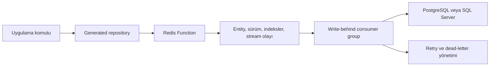

# CacheDB Mimarisi

English version: [../../docs/architecture.md](../../docs/architecture.md)

## 1. Sistem Sınırı

CacheDB, Redis öncelikli bir persistence ve okuma modeli framework'üdür. Her SQL
sorgusunun önüne şeffaf biçimde yerleşen genel amaçlı bir cache değildir.

- Açıkça tanımlanan düşük gecikmeli entity ve projection route'larını Redis sunar.
- PostgreSQL veya SQL Server kalıcı doğruluk kaynağı olarak kalır.
- Yazmalar Redis tarafından kabul edilir ve sürüm kontrollü write-behind ile kalıcılaştırılır.
- Arşiv ve geçmiş okumaları açık, sınırlı kaynak route'larıyla yapılır.
- Processor; codec, metadata, repository implementasyonu, Spring bean'i,
  ilişki loader'ı ve projection eşlemesini reflection kullanmadan üretir.

Hangi route'un Redis'te bulunacağına uygulama ekibi karar verir. CacheDB bu kararı
çalıştırılabilir, sınırlı, gözlemlenebilir ve test edilebilir hale getirir.

## 2. Uygulama Programlama Modeli

Entity sınıfları veri yapısını tanımlar:

- `@CacheEntity`, `@CacheId` ve `@CacheColumn` kalıcı satırı eşler.
- `@CacheRelation`, CacheDB'nin yükleme metadata'sıdır; veritabanında foreign key oluşturmaz.
- `@CacheProjectionRecord`, kompakt veya sıralanmış okuma modellerini tanımlar.

Repository arayüzleri uygulama davranışını tanımlar:

- `@CacheLookup`, sonucu açık durumla dönen ve yalnızca Redis'ten çalışan tekil okumadır.
- `@HotRoute`, sınırlı bir Redis entity veya projection penceresidir.
- `@SourceRoute` ve `@SourceSql`, sınırlı kalıcı veri okumalarıdır.
- `@WarmRoute`, var olan kritik route'tan ön yükleme planı üretir.
- `@CacheCommand`, acknowledgement ve kalıcılık gereksinimini belirtir.

`HotLookup.NOT_CACHED`, kalıcı kaydın bulunmadığı anlamına gelmez. Kritik route
arkasında gizli SQL fallback özellikle bulunmaz.

## 3. Yazma Akışı

1. Repository, komut şeklini ve generated ID politikasını doğrular.
2. Redis; payload, sürüm, indeks ve kalıcı stream olayını atomik olarak günceller.
3. Çağıran taraf, tanımlanan acknowledgement moduna göre `WriteReceipt` alır.
4. Worker'lar stream olaylarını toplu işler ve sürüm kontrollü SQL upsert/delete uygular.
5. Retry idempotent kalır; eski sürüm daha yeni kalıcı verinin üzerine yazamaz.

`REDIS_ACCEPTED`, SQL gecikmesini istek yolundan çıkarır. `SQL_DURABLE`, receipt
kalıcı olana kadar sınırlı bir timeout ile bekler.

## 4. Okuma Akışları

### Yalnızca Redis'ten detay

`@CacheLookup`; `HIT`, `NOT_CACHED`, `TOMBSTONED` veya `OUTSIDE_HOT_POLICY`
döndürür. Uygulama bu durumları açıkça işler. Redis'te veri bulunmaması SQL
sorgusu başlatmaz.

### Redis veri penceresi

`@HotRoute`; sınırlı `WindowRequest`, keyset cursor, route bellek sözleşmesi ve
coverage kapsamı kullanır. Projection route'ları mümkün olduğunda pencereyi geniş
entity yüklemesinden önce uygular.

### Kalıcı kaynak penceresi

`@SourceRoute` ve gözden geçirilmiş `@SourceSql` metotları seçilen SQL provider'ı
derleme zamanında belirlenen satır limiti ve query timeout ile sorgular. Sonuçlar
Redis'i kendiliğinden doldurmaz.

### Warm ve coverage

`@WarmRoute`, kritik route'un filtre, sıralama, projection ve kapsamını aynen
kullanır. Warm yalnızca projection'ı veya entity ile projection'ı birlikte
yükleyebilir. Tamamlanan çalışma route coverage bilgisini kaydeder. Böylece boş
sonuç ile eksik Redis kapsamı birbirinden ayrılır.

## 5. İlişkiler ve N+1 Kontrolü

İlişkiler açık ve sınırlıdır:

- veritabanı primary/foreign key'leri kalıcı veri bütünlüğünü korur
- `@CacheRelation`, CacheDB'ye ilişkili satırları nasıl toplu yükleyeceğini söyler
- `@CacheLookup(maxRelationRows=...)`, detay önizlemesini sınırlar
- büyük child koleksiyonları tam aggregate yerine projection penceresi kullanır
- generated loader parent ID'lerini gruplar ve parent başına SQL çağrısını önler

Veritabanında foreign key bulunması, `@CacheRelation` yoksa CacheDB preload'u
açmaz. Veritabanında foreign key olmadan `@CacheRelation` çalışabilir; ancak
kalıcı referans bütünlüğü uygulamanın sorumluluğunda kalır.

## 6. Redis Veri Kümesi ve Bellek Modeli

Redis kapasitesi birbirinden bağımsız sözleşmelerle yönetilir:

- entity kabul politikası: sayı, zaman, durum, özel kural veya bileşik politika
- route sayfa ve Redis penceresi sınırları
- projection payload boyutu ve sıralama indeksleri
- tenant kotası ve route bellek bütçesi
- CacheDB'ye ayrılmış Redis için `maxmemory` ve `noeviction` disiplini
- politika dışına çıkan kayıtlar için artımlı reconciliation

Framework, güvensiz sorgu şekillerini mümkün olduğunca çalışmadan önce reddeder.
Production strict mode, projection gereken bir route'u sessizce geniş entity
taramasına çevirmemelidir.

## 7. Tutarlılık Modeli

Yazma yolu Redis ile kalıcı provider arasında eventual consistency kullanır.
Doğruluk şu mekanizmalara dayanır:

- Redis AOF ve stream kalıcılığı
- artan entity sürümleri
- sürüm kontrollü SQL yazımları
- idempotent retry ve dead-letter recovery
- başka uygulamalar SQL'i doğrudan değiştiriyorsa outbox/CDC apply
- sınırlı onarım döngüsü olarak periyodik warm ve reconciliation

Projection yenilemesi asenkron olabilir. Trafik yönlendirilmeden önce route
bazında projection gecikmesi ve coverage gözlemlenmelidir.

## 8. Çok Pod'lu Koordinasyon

Uygulama pod'ları Redis consumer group'larını paylaşır. Consumer adına pod'a
özel instance ID eklenir; pod kapandığında bekleyen iş başka pod tarafından
devralınabilir.

- write-behind ve projection worker'ları ortak consumer group ile yatay ölçeklenir
- periyodik warm, aynı işi tek pod'un çalıştırması için Redis lease kullanır
- cleanup, reporting ve history döngüleri gerektiğinde leader lease ile tekil çalışır
- lease kaybı algılanır ve hatalı tamamlanma kaydı yazılmaz
- worker ve SQL pool boyutu tek pod'a değil cluster toplamına göre hesaplanır

Redis hem kritik okuma veri katmanı hem worker koordinasyon katmanıdır. Bu nedenle
kalıcılık, failover, timeout ve kaynak sınırları bu role uygun işletilmelidir.

## 9. SQL Provider Modeli

`cachedb-storage-jdbc`, ortak kaynak sorgusu ve provider SPI sözleşmelerini taşır.
`cachedb-storage-postgres` ve `cachedb-storage-mssql`; dialect, kilit,
idempotency, retry sınıflandırması ve metadata davranışını sağlar.

Spring Boot uygulaması tam olarak bir provider starter seçer. Classpath'te tek
provider varsa `AUTO` bunu seçer; birden fazla provider varsa uygulama belirsiz
bir seçim yapmak yerine başlangıçta hata verir.

Provider'a özel tuning yine gereklidir:

- bağlantı ve statement timeout zinciri
- pool boyutu ile cluster toplam worker concurrency ilişkisi
- transaction isolation ve lock timeout
- batch ve parametre sınırları
- JDBC driver ve pool'un failover davranışı

## 10. Modül Haritası

| Modül | Sorumluluk |
| --- | --- |
| `cachedb-annotations` | Entity, projection, repository, route, warm, komut ve ID sözleşmeleri |
| `cachedb-processor` | Derleme zamanı kontrolü ve reflection kullanmayan kod üretimi |
| `cachedb-core` | Repository sözleşmeleri, query modeli, coverage, policy ve guardrail'lar |
| `cachedb-storage-redis` | Redis Functions, payload/indeks saklama, stream, coverage ve ID üretimi |
| `cachedb-storage-jdbc` | Ortak JDBC kaynak katmanı ve provider SPI |
| `cachedb-storage-postgres` | PostgreSQL kalıcı provider'ı |
| `cachedb-storage-mssql` | SQL Server kalıcı provider'ı |
| `cachedb-starter` | Runtime başlangıcı, warm runner, worker'lar ve operasyonel wiring |
| `cachedb-spring-boot-starter-*` | Core, provider ve isteğe bağlı admin auto-configuration |
| `cachedb-spring-boot-test` | Route coverage ve entegrasyon testi yardımcıları |
| `cachedb-maven-plugin` | Build sırasında provider ve yapılandırma kontrolü |
| `cachedb-migration-recipes` | Geçiş planı, warm, karşılaştırma ve canlı geçiş kanıtı |
| `cachedb-bom` | Tutarlı bağımlılık sürümleri |

## 11. Operasyon ve Gözlemlenebilirlik

İç yönetim ve Actuator yüzeyleri şunları gösterir:

- provider kimliği ve yapılandırma sağlığı
- write-behind backlog, retry ve dead-letter durumu
- projection gecikmesi ve route coverage
- Redis baskısı, kabul, çıkarma ve tenant kotası sinyalleri
- periyodik warm, reconciliation ve lease durumu
- migration veri eşitliği, gecikme, bellek ve canlı geçiş kanıtı

Yönetim endpoint'leri operasyon yüzeyidir. Uygulamanın gateway/auth sınırı
arkasında ve genel istek yolunun dışında tutulmalıdır.

## 12. Bilinçli Sınırlar

- Deklaratif repository API'si bileşik primary key desteklemez; kararlı bir
  surrogate ID ve indeksli iş anahtarı alanları kullanılır.
- CacheDB, rastgele uygulama sorgularından kritik route tahmin etmez.
- Her SQL tablosunu kendiliğinden Redis entity'sine dönüştürmez.
- Büyük raporlama, export ve arşiv taramaları veritabanı/reporting işi olarak kalır.
- Library testi, uygulamanın SQL Server Always On veya PostgreSQL HA topolojisini
  sertifikalandıramaz; her deployment kendi failover kanıtını üretmelidir.

Bu sınırlar davranışı açık tutar ve pahalı production işlerinin ORM benzeri
kolaylıkların arkasında gizlenmesini önler.
